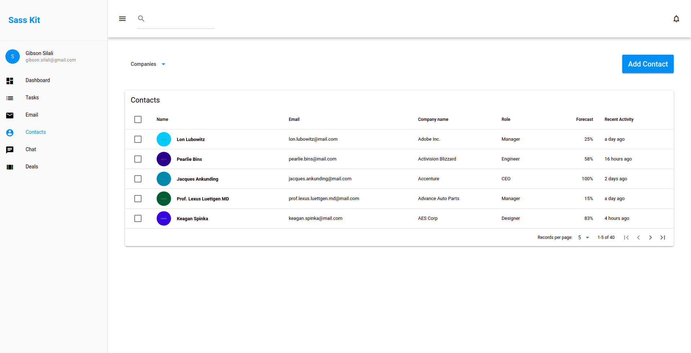
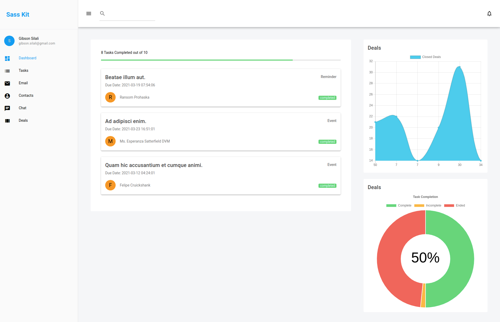

# Alx Frontend (alx-frontend)

Technical assessment for ALX interview process

This application consist of
  - VueJs frontend using the Quasar Framework
  - Simple Laravel back-end that provides dynamic data through an API

##Screenshots
###Contacts

###Dashboard


## Install the dependencies
```bash
yarn
```

### Start the app in development mode (hot-code reloading, error reporting, etc.)
```bash
quasar dev
```

### Lint the files
```bash
yarn run lint
```

### Build the app for production
```bash
quasar build
```

### Customize the configuration
See [Configuring quasar.conf.js](https://quasar.dev/quasar-cli/quasar-conf-js).

